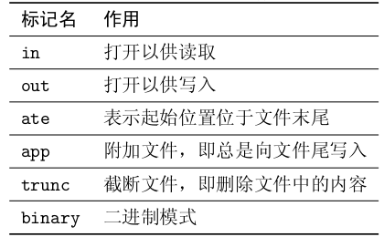

# 第八章 IO库

推荐书：《Standard C++ IOStreams and Locales》

 ## IOStream概述

- IOStream采用<u>流式I/O</u>而非<u>记录I/O</u>，但可以在此基础上引入结构信息
- 所处理的两个主要问题
  - 表示形式的变化：使用格式化/解析在数据的内部表示与<u>字符</u>序列间转换
  - 与外部设备的通信：针对不同的外部设备（终端、文件、内存）引入不同的处理逻辑
- 所涉及到的操作
  - 格式化/解析
  - 缓存
  - 编码转换，如UTF8等
  - 传输
- 采用<u>模板</u>来封装字符特性，采用<u>继承</u>来封装设备特性
  - 常用的类型实际上是类模板实例化的结果

## 输入与输出

- 输入与输出分为格式化与非格式化两类
- 非格式化I/O：不涉及数据表示形式的变化
  - 常用输入函数：`get`/`read`/`getline`/`gcout`
  - 常用输出函数：`put`/`write`

```C++
#include <iostream>

int main()
{
    int x;
    std::cin.read(reinterpret_cast<char*>(&x), sizeof(x)); // 非格式化输入
    std::cout << x << std::endl; // 格式化输出
}
```

- 格式化I/O：使用移位操作符来进行的输入（`>>`）与输出（`<<`）
  - C++通过<u>操作符重载</u>以支持*内建数据类型*的格式化I/O
  - 可以通过<u>重载操作符</u>以支持*自定义类型*的格式化I/O

- 格式控制
  - 可接收位掩码类型（示例：`showpos`）、字符类型（`fill`）与取值相对随意（`width`）的格式化参数

    ```c++
    #include <iostream>
    
    int main()
    {
        char x = '1';
        std::cout.setf(std::ios_base::showpos);
        std::cout.width(10);
        std::cout.fill('.');
        std::cout << x << std::endl; // char无符号意义，故此处不打印x的符号
        int y = static_cast<int>(x);
        std::cout << y << std::endl; // width被触发后重置，故对y的输出不影响
    }
    ```
  
  - 注意`width`方法的特殊性：触发后被重置
  
- 操纵符(`#include <iomanip>`)
  - 简化格式化参数的设置
  
  - 触发实际的插入与提取操作
  
    ```c++
    #include <iostream>
    #include <iomanip>
    
    int main()
    {
        char x = '1';
        int y = static_cast<int>(x);
    
        std::cout << std::showpos << std::setw(10)
                                  << std::setfill('.')
                                  << x << '\n'
                                  << std::setw(10)
                                  << y << '\n';
    }
    ```
  
- 提取会放松对格式的限制

- 提取C风格字符串时要小心内存越界

  ```c++
  #include <iostream>
  #include <iomanip>
  #include <string>
  
  int main()
  {
      std::string x;
      std::cin >> x;
      std::cout << x << std::endl;
  }
  ```

  ```c++
  #include <iostream>
  
  int main()
  {
      char x[5];
      std::cin >> x;               // abcdefg\0
      std::cout << x << std::endl; // error
  }
  ```

## 文件与内存操作

- 文件操作
  - `basic_ifstream`/`basic_ofstream`/`basic_fstream`
  
  - 文件流可以处于打开/关闭两种状态，处于打开状态时无法再次打开，只有打开时才能I/O
  
    `is_open`/`open`/`close`
  
    ```c++
    #include <iostream>
    #include <fstream>
    #include <string>
    
    int main()
    {
        std::ofstream outFile_1("my_file");
        std::cout << outFile_1.is_open() << '\n'; // 1
        outFile_1 << "Hello\n";
    
        std::ofstream outFile_2; // default
        std::cout << outFile_2.is_open() << '\n'; // 0
        // outFile_2 << "Hello\n";
    }
    ```
  
    ```c++
    #include <iostream>
    #include <fstream>
    #include <string>
    
    int main()
    {
        std::ofstream outFile_2; // default
        std::cout << outFile_2.is_open() << '\n'; // 0
        outFile_2.open("my_file");
        std::cout << outFile_2.is_open() << '\n'; // 1
        outFile_2.close();
        std::cout << outFile_2.is_open() << '\n'; // 0
    }
    ```
  
- 文件流的打开模式
  - 每种文件流都有缺省的打开方式
  
    ```c++
    // 以下两种语句等价
    std::ofstream outFile_default("my_file");
    std::ofstream outFile_full("my_file", std::ios_base::out);
    ```
  
  - 注意`ate`与`app`的异同
  
    `ate`起始位置位于文件末尾但是可以移动写入位置；
  
    `app`起始位置为文件末尾同时不能改变写入位置。
  
  - `binary`能禁止系统特定的转换
  
  - 避免意义不明确的流使用方式（如`ifstream`+`out`）



```c++
#include <iostream>
#include <fstream>
#include <string>

int main()
{
    std::ofstream outFile_default("my_file"); // Hello
    // 写入并删除之前的内容
    std::ofstream outFile_full("my_file", std::ios_base::out | std::ios_base::trunc);
    outFile_full << "What's your name?"; // What's your name?
}
```

- 合法的打开方式组合


- 内存流：`basic_istringstream`/`basic_ostringstream`/`basic_stringstream`

  `#include <sstream>`

  ```c++
  #include <iostream>
  #include <sstream>
  
  int main()
  {
      std::ostringstream obj1;
      obj1 << 1234; // int
      std::string res = obj1.str(); // int -> string
      std::cout << res << std::endl; // string
  }
  ```

- 也会受打开模式：`in`/`out`/`ate`/`app`的影响

- 使用str()方法获取底层所对应的字符串
  - 小心避免使用`str().c_str()`的形式获取C风格字符串
  
- 基于字符串流的字符串拼接优化操作

## 流的状态、定位与同步

### 流的状态

- <u>`iostate`</u>——>位掩码类型（BitmaskType）
  - `failbit`/`badbit`/`eofbit`/`goodbit`
    - `failbit`：输入/输出操作失败（格式化或提取错误）——可以恢复的错误
    - `badbit`：系统级错误，不可恢复的流错误
    - `eofbit`：关联的输入序列（input sequence）已抵达文件尾（end of file）
      - 如果到达文件结束位置，实际上`failbit`和`eofbit`均会被置位
    - `goodbit`：无错误
    - 如果`badbit`、`failbit`和`eofbit`中任一个被置位，则检测流状态的条件失败

  ```c++
  #include <iostream>
  
  int main()
  {
      int x;
      std::cin >> x;
  
      std::cout << std::cin.good()
                << std::cin.bad()
                << std::cin.fail()
                << std::cin.eof()
                << static_cast<bool>(std::cin) << std::endl;
  }
  ```

- 检测流的状态
  - `good()`/`fail()`/`bad()`/`eof()`方法
    - 一般而言，`failbit`被置位的同时，`badbit`也会被置位
  - 转换为`bool`值（参考cppreference）

  ```c++
  #include <iostream>
  
  int main()
  {
      char x;
      std::cin >> x; // input: a[Ctrl+D]
      std::cout << std::cin.fail() << ' ' << std::cin.eof() << std::endl; // 0 0
      std::cin >> x;
      std::cout << std::cin.fail() << ' ' << std::cin.eof() << std::endl; // 1 1
  }
  ```

  ```c++
  #include <iostream>
  
  int main()
  {
      int x;
      std::cin >> x; // input: 10[Ctrl+D]
      std::cout << std::cin.fail() << ' ' << std::cin.eof() << std::endl; // 0 1
      // 显然fail()和eof()可能会被同时设置，但二者含义不同
  }
  ```

- 注意区分`fail`与`eof`
  - 可能会被同时设置，但二者含义不同
  - 转换为`bool`值时不会考虑`eof`

- 通常来说，只要流处于某种错误状态时，插入/提取操作就不会生效——>双向流

- 复位流状态
  - `clear`：设置流的状态为具体的值（缺省为`goodbit`）
  - `setstate`：将某个状态<u>附加</u>到现有的流状态上

- 捕获流异常：<u>`exceptions`方法</u>

### 流的定位

- 获取流位置
  - `tellg()`/`tellp()`可以用于获取输入（g: get）/输出（p: put）流位置（`pos_type`类型）
  - 两个方法可能会失败，此时返回`pos_type(-1)`

- 设置流位置

  - `seekg()`/`seekp()`用于设置输入（g: get）/输出（p: put）流的位置

  - 这两个方法分别有两个重载版本：

    - 设置绝对位置：传入`pos_type`进行设置

    - 设置相对位置：通过偏移量（字符个数`ios_base::beg`）+流位置符号的方式设置

      `ios_base::beg`——>流的开始

      `ios_base::cur`——>流位置指示器的当前位置

      `ios_base::end`——>流的结尾

### 流的同步——>缓冲区的刷新

- 基于`flush()`/`sync()`/`unitbuf`的同步
  - `flush()`用于输出流同步，不输出任何额外的字符，刷新缓冲区
    
    - `std::endl;`等价于换行+刷新；
    - `std::ends;`等价于向缓冲区插入一个空字符，然后刷新缓冲区；
    
  - `sync()`用于输入流同步，其实现逻辑是编译器所定义的
  
  - 输出流可以通过设置`unitbuf`来保证接下来的每次输出后自动同步
    - `std::cerr;`
    - `nounitbuff`操纵符重置流，使其恢复使用正常的系统管理的缓冲区刷新机制
    
    ```c++
    std::cout << unitbuf; // 所有输出操作后都会立即刷新缓冲区
    // 任何输出都立即刷新，无缓冲
    std::cout << nounitbuf; // 回到正常的缓冲方式
    ```
  
- 基于绑定（tie）的同步
  - 流（A）可以绑定到*一个*输出流（B）上，这样在每次输入/输出（A）前可以刷新输出流（B）的缓冲区
  - 比如：`cin`绑定到了`cout`上
  - 每个流同时最多关联到一个流，但多个流可以同时关联到同一个ostream
  
- 与C语言标准IO库的同步
  - 缺省情况下，C++的输入输出操作会与C的输入输出函数同步
  - 可以通过`sync_with_stdio`关闭该同步

```c++
#include <iostream>
#include <cstdio>

int main()
{
    std::ios::sync_with_stdio(false);
    std::cout << "a\n";
    std::printf("b\n");
    std::cout << "c\n";
    // possible output:
    // b
    // a
    // c
}
```