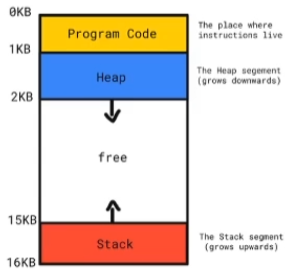

# 第12章 动态内存

- 对象的生命周期
  - 全局对象：程序启动时分配，程序结束时销毁
  - 局部自动对象：在进入定义的程序块时创建，离开该程序块时销毁
  - 局部static对象：第一次使用前分配，程序结束时销毁
- 内存
  - 静态内存：保存局部static对象、类static数据成员以及定义在任何函数*之外*的变量
  - 栈内存：保存定义在函数*内*的非static对象
    - 分配在静态内存或栈内存中的对象由编译器自动创建和销毁
  - 内存池（自由空间free store 和 堆heap）

## 1. 动态内存基础

- 栈内存 V.S. 堆内存
  - 栈（后进先出）内存的特点：更好的局部性，对象编译器自动销毁——> Stack
  - 堆内存的特点：运行期动态扩展，需要显式释放——> Heap



- 在C++中通常使用`new`与`delete`来构造、销毁对象

  ```c++
  #include <iostream>
  
  int main()
  {
      int* y = new int(2);
      std::cout << *y << std::endl;
      // ...
      delete y;
  }
  ```

  ```c++
  #include <iostream>
  
  int* fun()
  {
      int* res1 = new int(2);       // 使用堆内存
      // int res2 = 2;              // 使用栈内存
      return res1;
      // return res2;
  }
  int main()
  {
      int* y = new int(2);
      // int* y = fun();            // 注意此处使用栈内存，指针指向临时变量，是一种很危险的用法
      std::cout << *y << std::endl;
      // ...
      delete y;
  }
  ```

- 对象的构造分成两步：分配内存与在所分配的内存上构造对象；对象的销毁与之类似

- `new`的几种常见形式
  - 构造单一对象/对象数组
  
    ```c++
    #include <iostream>
    
    int main()
    {
        int* y = new int[5]; // 该代码连续开辟了20字节(1 int = 4 bytes)
                             // 这5个int进行缺省初始化
                             // 该代码将连续的20个byte的首地址返回并存在y中
                             // 或将5个int的首地址返回并存在y中
        int* x = new int[5]{1, 2, 3, 4, 5}; // 初始化
        std::cout << x[2] << std::endl;
        delete[] x; // 删除x
    }
    ```
  
  - `nothrow new` ——> 避免抛出异常
  
    ```c++
    #include <iostream>
    #include <new>
    
    int main()
    {
        // int* y = new int[5]{};   // new 会自动抛出异常
        // 如需要对异常进行讨论则应该使用 std::nothrow 避免抛出异常
        int* y = new(std::nothrow) int[5]{};
        if (y == nullptr)
        {
            // 若存在异常则处理if语句块
        }
        std::cout << y[2] << std::endl;
    
        delete[] y;
    }
    ```
  
  - `placement new`
  
    ```c++
    #include <iostream>
    #include <new>
    
    int main()
    {
        // placement new
        char ch[sizeof(int)];
        int* y = new (ch) int(4);
        std::cout << *y << std::endl;
    }
    ```
  
  - `new auto`
  
    ```c++
    int* y = new auto(3);
    ```
  
- `new`与对象对齐

  ```c++
  #include <iostream>
  #include <new>
  
  struct alignas(1024) Str{}; // 对齐地址为1024的整数倍
  int main()
  {
      Str* ptr = new Str();
      std::cout << ptr << std::endl;
  }
  ```

- `delete`的常见用法
  
  - 销毁单一对象/数组
  - `placement delete`
  
- 使用`new`与`delete`的注意事项
  - 根据分配的是单一对象还是数组，采用相应的方式销毁
  - `delete nullptr`
  - 不能`delete`一个非`new`返回的内存
  - 同一块内存不能`delete`多次
  
- 调用系统自身的`new`/`delete`行为
  - 不要轻易使用

## 2. 智能指针

- 使用`new`与`delete`的问题：内存所有权不清晰，容易产生不销毁、多销毁的情况
- C++的解决方案：智能指针
  - `auto_ptr`（C++17删除）
  - `shared_ptr`/`unique_ptr`/`weak_ptr`
- `shared_ptr`——基于引用计数的共享内存解决方案
  - 基本用法
  - `reset`/`get`方法
  - 指定内存回收逻辑
  - `std::make_shared`
  - 支持数组（C++17支持`shared_ptr<T[]>`；C++20支持`make_shared`分配数组）
  - 注意：`shared_ptr`管理的对象不要调用`delete`销毁
- `unique_ptr`——独占内存的解决方案
  - 基本用法
  - `unique_ptr`不支持复制，但可以移动
  - 为`unique_ptr`指定内存回收逻辑
- `weak_ptr`——防止循环引用而引入的智能指针
  - 基于`shared_ptr`构造
  - `lock`方法

## 3. 动态内存的相关问题

- `sizeof`不会返回动态分配的内存大小
- 使用分配器（`allocator`）来分配内存
- 使用`malloc`/`free`来管理内存
- 使用`aligned_alloc`来分配对齐内存
- 动态内存与异常安全
- C++对于垃圾回收的支持

