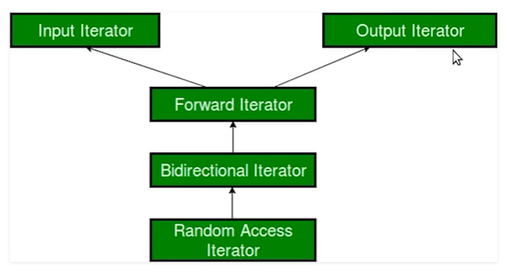
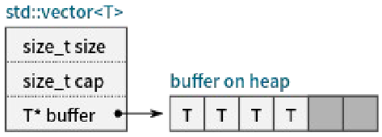
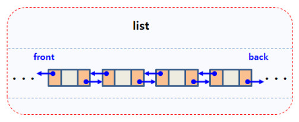
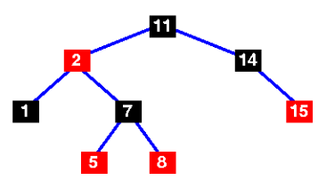
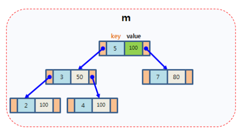
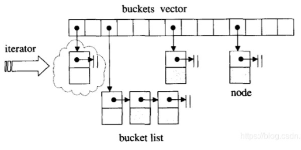

# 第9章 顺序容器

## 1. 容器概述

- 容器：一种特殊的类型，其对象可以放置其他类型的对象（元素）
  - 需要支持的操作：对象的添加、删除、索引、遍历
  - 有多种算法可以实现容器，每种方法各有利弊
  
- 容器分类
  - 序列容器：其中的对象有序排列，使用整数值进行索引
  - 关联容器：其中的对象顺序并不重要，使用键进行索引
  - 适配器：调整原有容器的行为，使得其对外展现出新的类型、接口或返回新的元素
  - 生成器：构造元素序列
  
- 迭代器：用于指定容器中的一段区间，以执行遍历、删除等操作
  - 获取迭代器：`(c)begin`/`(c)end`; `(c)rbegin`/`(c)rend`
  
    - `(c)rbegin`/`(c)rend` ——> r -> reverse 从后往前遍历
  
    ```c++
    #include <iostream>
    #include <vector>
    
    int main()
    {
        std::vector<int> x{1, 2, 3};
        // 构造 [b,e) 前开后闭区间
        auto b = x.begin();
        auto e = x.end();
        for (auto ptr = b; ptr < e; ++ptr)
        {
            std::cout << *ptr << ' ';
        }
    }
    
    
    ```
  
  - 迭代器分类：分成5类（category），不同的类别支持的操作集合不同
  
    

## 2. 序列容器

- C++标准库中提供了多种序列容器模板
  - `array`：元素个数固定的序列容器
  - `vector`：元素连续存储的序列容器
  - `forward_list`/`list`：基于链表/双向链表的容器
  - `deque`：`vector`与`list`的折中
  - `basic_string`：提供了对字符串的专门的支持
  
- 需要使用元素类型来实例化容器模板，从而构造可以保存具体类型的容器。

  `std::vector<int> x;`

- 不同的容器所提供的接口大致相同，但根据容器性质的差异，其内部实现与复杂度不同。

- 对于复杂度过高的操作，提供相对较难使用的接口或者不提供相应的接口

### `array`容器模板

- 具有固定长度的容器，其内部维护了一个内建数组，与内建数组相比提供了复制操作

- 提供的接口
  - 构造
  
  - 成员类型：`value_type`等
  
    ```c++
    #include <iostream>
    #include <array>
    #include <type_traits>
    
    int main()
    {
        std::array<int, 3> a;
        std::cout << std::is_same_v<std::array<char, 3>::value_type, char>;
    }
    ```
  
  - 元素访问：`[]`, `at`, `front`, `back`, `data`
  
    `data` ——> `T*`，如果容器中的元素在内存中连续保存，则往往引入`data`接口进行访问。
  
    ```c++
    #include <iostream>
    #include <array>
    
    void fun(int* ptr)
    {
        // ...
    }
    int main()
    {
        std::array<int, 3> a = {1, 2, 3};
        fun(a.data());
    }
    ```
  
  - 容量相关（平凡实现）：`empty`, `size`, `max_size`
  
  - 填充与交换：`fill`, `swap`
  
    `swap`实现两个`array`交换
  
    ```c++
    #include <iostream>
    #include <array>
    
    void fun(int* ptr)
    {
        // ...
    }
    int main()
    {
        std::array<int, 3> a;
        a.fill(100);
        std::cout << a[0] << ' '
                  << a[1] << ' '
                  << a[2] << ' ';
    }
    ```
  
  - 比较操作：`<=>` ——> 同类型按字典顺序
  
  - 迭代器

### `vector`容器模板



- 元素可变
- 提供的接口
  - 与`array`很类似，但有其特殊性
  - 容量相关接口：`capacity`/`reserve`/`shrink_to_fit`
  - 附加元素接口：`push_back`/`emplace_back`
  - 元素插入接口：`insert`/`emplace`
  - 元素删除接口：`pop_back`/`erase`/`clear`

- 注意
  - `vector`不提供`push_front`/`pop_front`，可以使用`insert`/`erase`模拟，但效率不高
  - `swap`效率较高
  - 写操作可能会导致迭代器失效


### `list`容器模板



- 双向链表
- 与`vector`相比，`list`
  - 插入、删除成本较低，但随机访问成本较高
  - 提供了`pop_front`/`splice`等接口
  - 写操作通常不会改变迭代器的有效性

### `forward_list`容器模板


- 单向列表
- 其迭代器只支持递增操作，因此无`rbegin`/`rend`
- 不支持`size`
- 不支持`pop_back`/`push_back`
- xxx_after操作

### `deque`容器模板

- `vector`与`list`的折中
- `push_back`/`push_front`速度更快
- 在序列中插入、删除速度较慢

### `basic_string`容器模板

- 实现了字符串相关的接口
- 使用char实例化出std::string
- 提供了如find, substr等字符串特有的接口
- 提供了数值与字符串转换的接口
- 针对短字符串的优化（short string optimization: SSO）

# 第11章 关联容器

## 3. 关联容器

- 使用键进行索引
  - `set`/`map`/`multiset`/`multimap`
  - `unordered_set`/`unordered_map`/`unordered_multiset`/`unordered_multimap`
- `set`/`map`/`multiset`/`multimap`底层使用红黑树实现
- unordered_xxx底层使用hash表实现

### `set`



- 通常来说，元素需要支持使用`<`比较大小
- 或者采用自定义的比较函数来引入大小关系
- 插入元素：`insert`/`emplace`/`emplace_hint`
- 删除元素：`erase`
- 访问元素：`find`/`contains`
- 修改元素：`extract`
- 注意：`set`迭代器所指向的对象是`const`的，不能通过其修改元素

### `map`



- 树中的每个结点是一个`std::pair`
- 键(`pair.first`)需要支持使用<比较大小
- 或者采用自定义的比较函数来引入大小关系
- 访问元素：`find`/`contains`/`[]`/`at`
- 注意：
  - `map`迭代器所指向的对象是`std::pair`，其键是`const`类型
  - `[]`操作不能用于常量对象

### `multiset`/`multimap`

- 与`set`/`map`类似，但允许重复键
- 元素访问
  - `find`返回首个查找到的元素
  - `count`返回元素个数
  - `lower_bound`/`upper_bound`/`equal_range`返回查找到的区间

### `unordered_set`/`unordered_map`/`unordered_multiset`/`unordered_multimap`



- 与`set`/`map`相比查找性能更好
- 但插入操作一些情况下会慢
- 其键需要支持两个操作
  - 转换为hash值
  - 判等
- 除`==`，`!=`外，不支持容器级的关系运算
  - 但`==`，`!=`速度较慢
- 自定义hash与判等函数

## 4. 适配器与生成器

### 类型适配器

- `basic_string_view` （C++17）
  - 可以基于`std::string`，C字符串，迭代器构造
  - 提供成本较低的操作接口
  - 不可进行写操作
- `span` （C++20）
  - 可基于C数组、`array`等构造
  - 可读写

### 接口适配器

- `stack`/`queue`/`priority_queue`
- 对底层序列容器进行封装，对外展现栈、队列与优先级队列的接口
  - `priority_queue`在使用时其内部包含的元素需要支持比较操作

### 数值适配器（C++20）

- `std::ranges::XXX_view`，`std::ranges::views::XXX`，`std::views::XXX`
  - 可以将一个输入区间中的值变换后输出
  - 数值适配器可以组合，引入复杂的数值适配逻辑

### 生成器（C++20）

- `std::ranges::itoa_view`，`std::ranges::views::itoa`，`std::views::itoa`
- 可以在运行期生成无限长或有限长的数值序列

