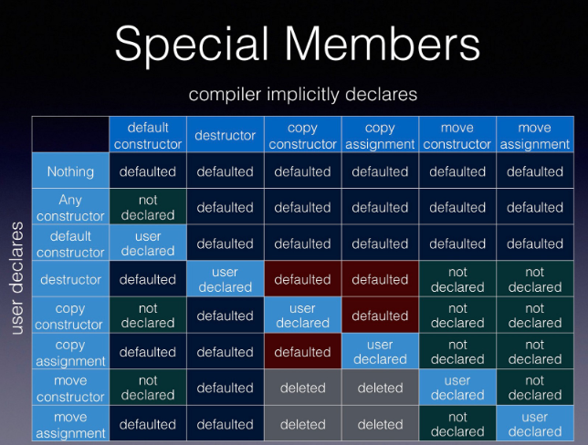

## 结构体与对象聚合

- 结构体：对基本数据结构进行扩展，将多个对象放置在一起视为一个整体
  - 结构体的声明与定义（注意定义后面要跟分号来表示结束）
  - 仅有声明的结构体是不完全类型（incomplete type）
  - 结构体（以及类）的一处定义原则：翻译单元级别
- 数据成员（数据域）的声明与初始化
  - （C++11）数据成员可以使用`decltype`来声明其类型，但不能使用`auto`
  - 数据成员声明时可以引入`const`、引用等限定
  - 数据成员会在构造类对象时定义
  - （C++11）类内成员初始化
  - 聚合初始化：从初始化列表到指派初始化器
- `mutable`限定符
- 静态数据成员——多个对象之间共享的数据成员
  - 定义方式的衍化
    - C++98：类外定义，`const`静态成员的类内初始化
    - C++17：内联静态成员的初始化
  - 可以使用auto推导类型
- 静态数据成员的访问
  - “`.`”与“`->`”操作符
  - “`::`”操作符
- 在类的内部声明相同类型的静态数据成员

## 成员函数（方法）

- 可以在结构体中定义函数，作为其成员的一部分：对内操作数据成员，对外提供调用接口
  - 在结构体中将数据与相关的成员函数组合在一起将形成类，是C++在C基础上引入的概念
  - 关键字`class`
  - 类可视为一种抽象数据类型，通过相应的接口（成员函数）进行交互
  - 类本身形成域，称为类域
- 成员函数的声明与定义
  - 类内定义（隐式内联）
  - 类内声明+类外定义
  - 类与编译期的两遍处理
  - 成员函数与尾随返回类型（trail returning type）
- 成员函数与`this`指针
  - 使用`this`指针引用当前对象
  - 基于`const`的成员函数重载
- 成员函数的名称查找与隐藏关系
  - 函数内部（包括形参名称）隐藏函数外部
  - 类内部名称隐藏类外部
  - 使用`this`或域操作符引入依赖型名称查找
- 静态成员函数
  - 在静态成员函数中返回静态数据成员
- 成员函数基于引用限定符的重载（C++11）

## 访问限定符与友元

- 使用public/private/protected限定类成员的访问权限
  - 访问权限的引入使得可以对抽象数据类型进行封装
  - 类与结构体缺省访问权限的区别
- 使用友元打破访问权限限制——关键字`friend`
  - 声明某个类或某个函数是当前类的友元——慎用！
  - 在类内首次声明友元类或友元函数
    - 注意使用限定名称引入友元并非友元类（友元函数）的声明
  - 友元函数的类内外定义与类内定义
  - 隐藏友元（hidden friend）：常规名称查找无法找到[（参考文献）](https://www.justsoftwaresolutions.co.uk/cplusplus/hidden-friends.html)
    - 好处：减轻编译器负担，防止误用
    - 改变隐藏友元的缺省行为：在类外声明或定义函数

## 构造、析构与复制成员函数

- 构造函数：构造对象时调用的函数

  - 名称与类名相同，无返回值，可以包含多个版本（重载）
  - （C++11）代理构造函数

- 初始化列表：区分数据成员的初始化与赋值

  - 通常情况下可以提升系统性能
  - 一些情况下必须使用初始化列表（如类中包含引用成员）
  - 注意元素的初始化顺序与其声明顺序相关，与初始化列表中的顺序无关
  - 使用初始化列表覆盖类内成员初始化的行为

- 缺省构造函数：不需要提供实际参数就可以调用的构造函数

  - 如果类中没有提供任何构造函数，那么在条件允许的情况下，编译器会合成一个缺省构造函数
  - 合成的缺省构造函数会使用缺省初始化来初始化其数据成员
  - 调用缺省构造函数时避免most vexing parse
  - 使用`default`关键字定义缺省构造函数

- 单一参数构造函数

  - 可以视为一种类型转换函数
  - 可以使用`explicit`关键字避免求值过程中的隐式转换

- 拷贝构造函数：接收一个当前类对象的构造函数

  - 会在涉及到拷贝初始化的场景被调用，比如：参数传递。因此要注意拷贝拷贝构造函数的形参类型
  - 如果未显式提供，那么编译器会自动合成一个，合成的版本会依次对每个数据成员调用拷贝构造

- 移动构造函数（C++11）：接收一个当前类右值引用对象的构造函数

  - 可以从输入对象中“偷窃”资源，只要确保传入对象处于合法状态即可
  - 当某些特殊成员函数（如拷贝构造）未定义时，编译器可以合成一个
  - 通常声明为不可抛出异常的函数
  - 注意右值引用对象用做表达式时是左值！

- 拷贝赋值与移动赋值（`operator=`）

  - 注意赋值函数不能使用初始化列表
  - 通常来说返回当前类型的引用
  - 注意处理给自身赋值的情况
  - 在一些情况下编译器会自动合成

- 析构函数

  - 函数名：“`~`”加当前类型，无参数，无返回值
  - 用于释放资源
  - 注意内存回收是在调用完析构函数时才进行
  - 除非显式声明，否则编译器会自动合成一个，其内部逻辑为平凡的
  - 析构函数通常不能抛出异常

- 通常来说，一个类：

  - 如果需要定义析构函数，那么也需要定义拷贝构造与拷贝赋值函数
  - 如果需要定义拷贝构造函数，那么也需要定义拷贝赋值函数
  - 如果需要定义构造（赋值）函数，那么也要考虑定义移动构造（赋值）函数

- 示例：包含指针的类

- `default`关键字

  - 只对特殊成员函数有效

- `delete`关键字

  - 对所有函数都有效
  - 注意其与未声明的区别
  - 注意不要为移动构造（移动赋值）函数引入`delete`限定符
    - 如果只需要拷贝行为，那么引入拷贝构造即可
    - 如果不需要拷贝行为，那么将拷贝构造声明为`delete`函数即可
    - 注意`delete`移动构造（移动赋值）对C++17的新影响

- 特殊成员的合成行为列表（红框表示支持但可能会废除的行为）

  

## 字面值类，成员指针与bind交互

- 字面值类：可以构造编译期常量的类型
  - 其数据成员需要是字面值类型
  - 提供`constexpr`/`consteval`构造函数（小心使用`consteval`）
  - 平凡的析构函数
  - 提供`constexpr`/`consteval`成员函数（小心使用`consteval`）
  - 注意：从C++14起`constexpr`/`consteval`成员函数非`const`成员函数
- 成员指针
  - 数据成员指针类型示例：`int A::*;`
  - 成员函数指针类型示例：`int (A::*)(double);`
  - 成员指针对象赋值：`auto ptr = &A::x;`
    - 注意域操作符子表达式不能加小括号（否则`A::x`一定要有意义）
  - 成员指针的使用：
    - 对象`.*`成员指针
    - 对象指针`->*`成员指针
  - `bind`交互
    - 使用`bind`+成员指针构造可调用对象
    - 注意这种方法也可以基于数据成员指针构造可调用对象